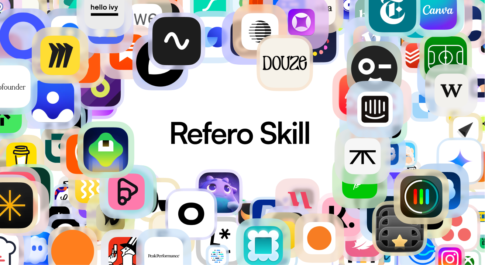

# Refero Design Skill

**Design with data, not defaults.**

Every AI agent has the same problem: it draws UI from training data averages. The result? Generic layouts, safe color choices, patterns you've seen a thousand times. Design that looks "AI-generated."

This skill changes that.

## What it does

**Research.** Before creating anything, your agent searches [Refero](https://refero.design) — 150,000+ screens and 6,000+ flows from products like Stripe, Linear, and Notion. Not generic best practices. Specific solutions that shipped.

**Craft.** The skill includes deep guides on typography, color, spacing, motion, and icons — the details that separate polished products from rough ones. Letter-spacing rules. Color token systems. Animation timing. The stuff AI usually gets wrong.

**Anti-slop.** Explicit rules to avoid the "AI look": no default indigo, no blob backgrounds, no generic hero layouts. Your agent learns what makes design feel human and intentional.

**Methodology.** A complete workflow from discovery questions through research, analysis, and implementation — with quality gates and side-by-side testing against references.

## The shift

| Without | With |
|---------|------|
| Guesses from training data | Researches 150K+ real screens |
| Generic "best practices" | Specific patterns that convert |
| Default colors and layouts | Intentional craft decisions |
| Looks AI-generated | Looks designed |

## Install

```bash
npx skills add https://github.com/bbssppllvv/refero_skill
```

Requires [Refero MCP](#setup-refero-mcp) to connect your agent to the design library.

---

<details id="setup-refero-mcp">
<summary>Setup Refero MCP</summary>

### 1. Get your token

[refero.design](https://refero.design)

### 2. Connect

**Claude Code:**
```bash
claude mcp add --transport http refero https://api.refero.design/v1/mcp --header "Authorization: <token>"
```

**Gemini CLI:**
```bash
gemini mcp add --transport http refero https://api.refero.design/v1/mcp --header "Authorization: <token>"
```

**Cursor** — add to `.cursor/mcp.json`:
```json
{
  "mcpServers": {
    "refero": {
      "url": "https://api.refero.design/v1/mcp",
      "headers": { "Authorization": "<token>" }
    }
  }
}
```

**Lovable:** Settings → Connectors → New MCP server → `https://api.refero.design/v1/mcp` → Bearer token

**Other tools:**
```
URL: https://api.refero.design/v1/mcp
Auth: Bearer <token>
```

</details>

<details>
<summary>Troubleshooting</summary>

```bash
npx skills add https://github.com/bbssppllvv/refero_skill --agent cursor
```

Or clone:
```bash
git clone https://github.com/bbssppllvv/refero_skill.git .cursor/skills/refero-design
```

</details>

<details>
<summary>What's inside</summary>

**SKILL.md** — Research-First methodology
- Discovery questions before designing
- Research strategies and query patterns  
- Analysis frameworks and steal lists
- Design craft summaries
- Quality gates and validation

**Reference guides:**
- `typography.md` — Scale, pairing, letter-spacing, line-height
- `color.md` — Palettes, tokens, dark mode, contrast
- `motion.md` — Timing, easing, micro-interactions
- `icons.md` — Sizing, optical corrections, libraries
- `craft-details.md` — Focus states, forms, accessibility
- `anti-ai-slop.md` — Avoiding the generic AI look
- `mcp-tools.md` — Refero API reference
- `example-workflow.md` — Complete design walkthrough

</details>

## License

MIT
